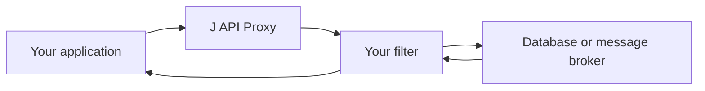
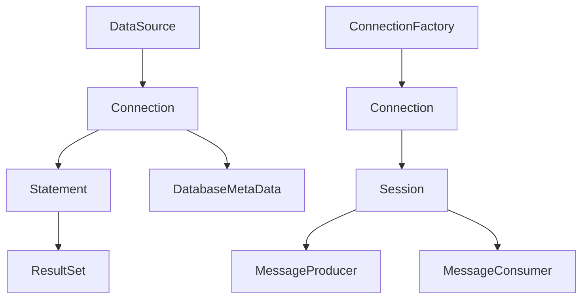

# Meet J API Proxy

When an application talks to a database or a message broker, a lot happens
between the first call and the final result. A connection opens, a statement
runs, a message is delivered, or a transaction is completed. Those are useful
places to collect timing data, add tracing, test failures, or apply a rule that
your application needs. The difficulty is not usually seeing the first call; it
is keeping that behavior in place while the application moves from a data
source to a connection, from a connection to a statement, and then to every
object returned along the way. J API Proxy gives you one simple way to do that.

## Why it exists

It is common to start with a small wrapper around a `DataSource` or a JMS
`ConnectionFactory`. That wrapper soon needs to deal with the objects returned
by the API too. A database request can pass through a connection, statement,
result set, metadata object, and sometimes an XA resource. A message can travel
through a connection, session, producer or consumer, while asynchronous
listeners bring calls back into the application. Writing and maintaining
separate wrappers for each layer is repetitive, and it is easy for one path to
miss the behavior that the first wrapper intended to provide.

The problem becomes more noticeable when an application needs the same idea in
more than one place. A team may want a timing filter for JDBC and Jakarta JMS,
or a test that makes an XA operation fail at a precise moment. Building one
implementation for the database and another for messaging means the rules
drift apart over time. J API Proxy was created to provide one small,
technology-neutral filter model that can follow both object graphs.

At its heart, J API Proxy wraps standard Java interfaces with JDK dynamic
proxies. You provide a small filter that sees a method call, can do work before
or after that call, and then lets the original object continue. The same filter
model works with JDBC, Jakarta JMS, and XA resources, so you do not have to
learn a separate interception approach for every kind of integration.



The useful part is that the wrapping does not stop at the first object. Wrap a
JDBC `DataSource`, for example, and J API Proxy also follows the objects it
returns. Connections, statements, result sets, metadata, and XA resources keep
the same filter as your code moves through the database API. The Jakarta JMS
adapter does the equivalent work for connection factories, sessions, producers,
consumers, contexts, and asynchronous listeners. You wrap the entry point once
and the rest of the object tree is covered as it is created.



## What using it feels like

This makes J API Proxy a good fit when you need behavior that crosses several
technologies. A timing filter can measure both database calls and message
operations. A test filter can simulate a failure at a chosen point. A tracing
filter can carry context through an outbound API call and an incoming JMS
callback. Since filters receive the method, arguments, return type, resource
name, and a per-call attribute map, they have the context they need without
forcing the rest of your application to change.

For example, the application can wrap its existing data source with
`JdbcProxy.wrap(vendorDataSource, "orders-db", timingFilter)`. The returned
`DataSource` is still used in the normal JDBC way, but calls to objects it
creates pass through `timingFilter` as well. The Jakarta JMS adapter follows the
same pattern with `JmsProxy.wrap`, so the filter code remains the same even
though the application is now talking to a message broker. The README includes
complete, copyable examples for both adapters and their XA counterparts.

Here is a small JDBC timing example. The filter records the elapsed time whether
the database call succeeds or fails, then the wrapped data source is used as
usual. The call to `executeQuery` is observed without wrapping the connection
or statement by hand.

```java
import io.github.rrobetti.japiproxy.core.InvocationFilter;
import io.github.rrobetti.japiproxy.jdbc.JdbcProxy;
import java.sql.Connection;
import java.sql.ResultSet;
import java.sql.Statement;
import javax.sql.DataSource;

InvocationFilter timingFilter = (invocation, chain) -> {
    long started = System.nanoTime();
    try {
        return chain.proceed(invocation);
    } finally {
        System.out.printf("%s took %d ns%n", invocation.method().getName(),
                System.nanoTime() - started);
    }
};

DataSource dataSource = JdbcProxy.wrap(vendorDataSource, "orders-db", timingFilter);

try (Connection connection = dataSource.getConnection();
     Statement statement = connection.createStatement();
     ResultSet resultSet = statement.executeQuery("select 1")) {
    resultSet.next();
}
```

Filters can simply observe calls, but they are not limited to observation. They
can adjust an argument before the delegate receives it, replace a result, or
choose not to continue a call. That makes the approach useful for carefully
scoped policy enforcement and fault-injection tests as well as metrics. The
original objects still do the real work; the proxy adds a well-defined place
for your application-specific behavior.

## Why not use an existing solution?

There are already excellent tools for parts of this problem. In the JDBC
world, [datasource-proxy](https://github.com/jdbc-observations/datasource-proxy)
is a mature choice for query logging, SQL formatting, parameter capture,
execution metrics, repeatable result sets, and generated-key handling. General
AOP tools can also intercept calls in an application when annotation-based or
class-level interception is the right fit. Vendor libraries may offer their own
wrappers for a particular database or broker.

Those solutions solve valuable problems, but their focus is different. A JDBC
tool naturally concentrates on JDBC and SQL, while a vendor wrapper generally
stays within that vendor's API. A general AOP framework offers a broader model
than is needed when the goal is to wrap standard integration interfaces and
continue wrapping what they return. None of those roles needs to be replaced.

J API Proxy fills the narrower gap between them: one dependency-free filter
model, applied recursively to standard JDBC, Jakarta JMS, and XA interfaces.
It intentionally does not reproduce SQL parsing, query logging, connection
pooling, transaction management, bytecode instrumentation, or class proxies.
For JDBC-focused observability, applications can use datasource-proxy alongside
J API Proxy rather than choosing one instead of the other. This separation
keeps J API Proxy small while allowing the same custom filter to work across
database, messaging, and XA code.

## A note about performance

J API Proxy adds work to every intercepted call. Each call goes through a JDK
dynamic proxy and the configured filter chain before it reaches the original
object, and recursive wrapping means that this applies to calls on returned
JDBC, JMS, and XA objects too. The cost depends on how frequently those methods
are called, how many filters are installed, and what each filter does. A filter
that logs, creates tracing data, or sends metrics can cost more than the proxy
layer itself.

For many database and broker operations, the network or the remote service is
likely to dominate the total time, but that is not a guarantee. A high-volume
local call path, a tight result-set loop, or an expensive filter can make the
added overhead meaningful. Measure the application with its real filters and
workload before using the proxy in a performance-sensitive path. Keep filters
small, avoid unnecessary work for calls you do not need to observe, and use the
proxy where the added visibility or control justifies the extra layer.

## Getting started

Getting started is straightforward: add the module that matches your use case,
write an `InvocationFilter`, and wrap the JDBC or Jakarta JMS entry point. The
[project README](../README.md) shows the Maven coordinates and small examples
for the core, JDBC, Jakarta JMS, and XA APIs. If your application already uses
standard interfaces, J API Proxy can help you observe and shape those calls
without replacing the objects and libraries you already trust. When vendor-only
behavior is needed, unwrap the delegate deliberately, knowing that direct calls
to it will bypass the filters.
