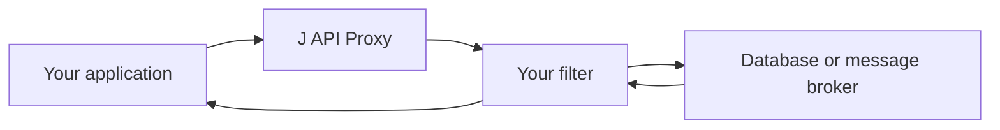
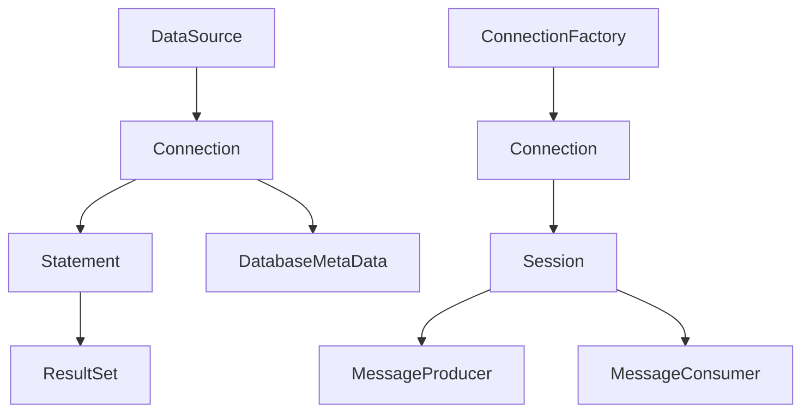

# Meet J API Proxy

When an application talks to a database or a message broker, a lot happens
between the first call and the final result. A connection opens, a statement
runs, a message is delivered, or a transaction is completed. Those are useful
places to collect timing data, add tracing, test failures, or apply a rule that
your application needs. J API Proxy gives you one simple way to do that.

At its heart, J API Proxy wraps standard Java interfaces with JDK dynamic
proxies. You provide a small filter that sees a method call, can do work before
or after that call, and then lets the original object continue. The same filter
model works with JDBC, Jakarta JMS, and XA resources, so you do not have to
learn a separate interception approach for every kind of integration.

The useful part is that the wrapping does not stop at the first object. Wrap a
JDBC `DataSource`, for example, and J API Proxy also follows the objects it
returns. Connections, statements, result sets, metadata, and XA resources keep
the same filter as your code moves through the database API. The Jakarta JMS
adapter does the equivalent work for connection factories, sessions, producers,
consumers, contexts, and asynchronous listeners. You wrap the entry point once
and the rest of the object tree is covered as it is created.

This makes J API Proxy a good fit when you need behavior that crosses several
technologies. A timing filter can measure both database calls and message
operations. A test filter can simulate a failure at a chosen point. A tracing
filter can carry context through an outbound API call and an incoming JMS
callback. Since filters receive the method, arguments, return type, resource
name, and a per-call attribute map, they have the context they need without
forcing the rest of your application to change.

J API Proxy deliberately stays focused. It is not an AOP framework, a
connection pool, a SQL parser, or a ready-made query logger. For detailed JDBC
query logging and formatting, it can sit alongside a purpose-built project
such as [datasource-proxy](https://github.com/jdbc-observations/datasource-proxy).
That separation keeps the proxy core small and makes it easier to use the tool
that best matches the job.

Getting started is straightforward: add the module that matches your use case,
write an `InvocationFilter`, and wrap the JDBC or Jakarta JMS entry point. The
[project README](../README.md) shows the Maven coordinates and small examples
for the core, JDBC, Jakarta JMS, and XA APIs. If your application already uses
standard interfaces, J API Proxy can help you observe and shape those calls
without replacing the objects and libraries you already trust.
